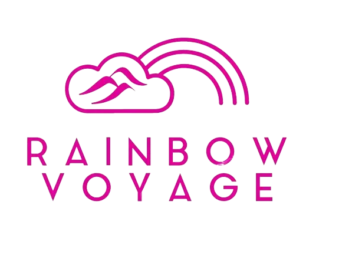
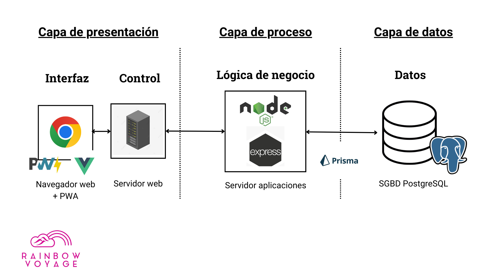
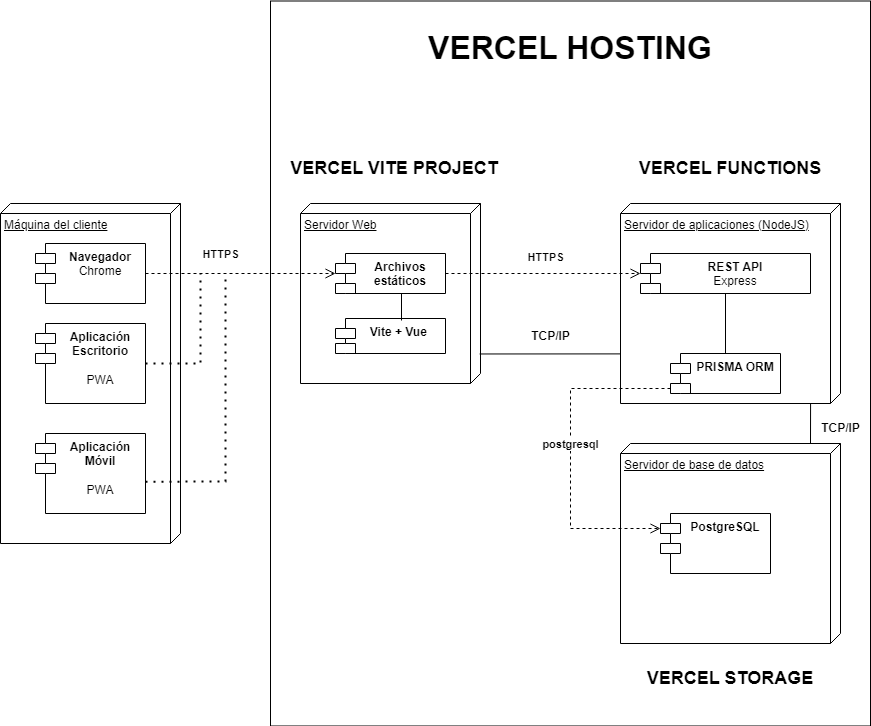
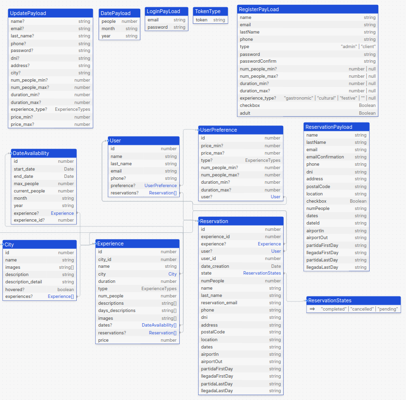
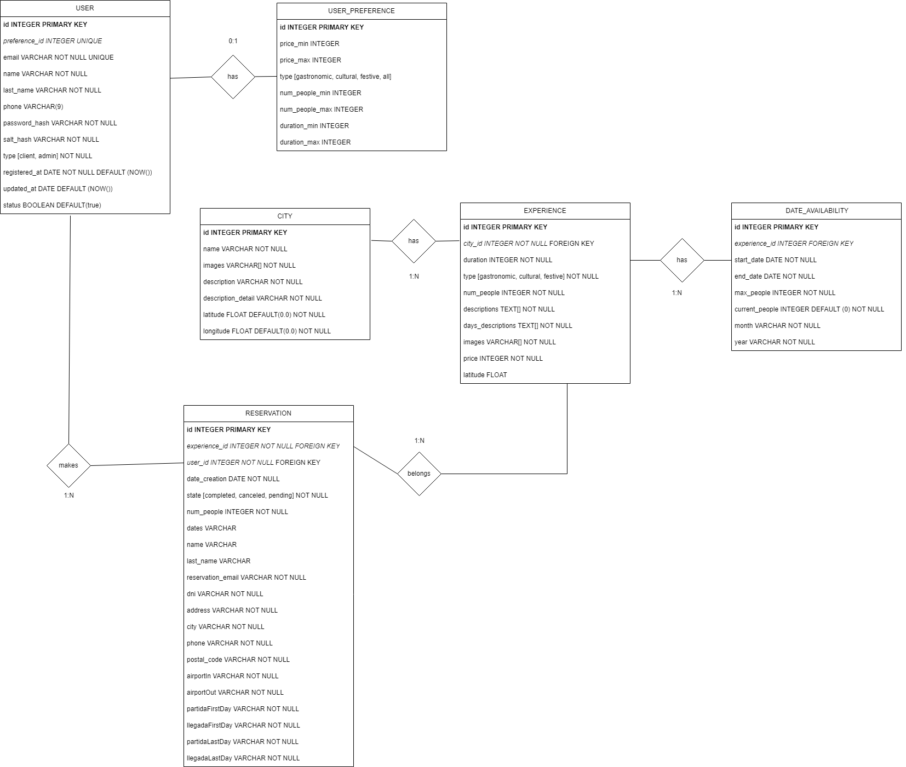
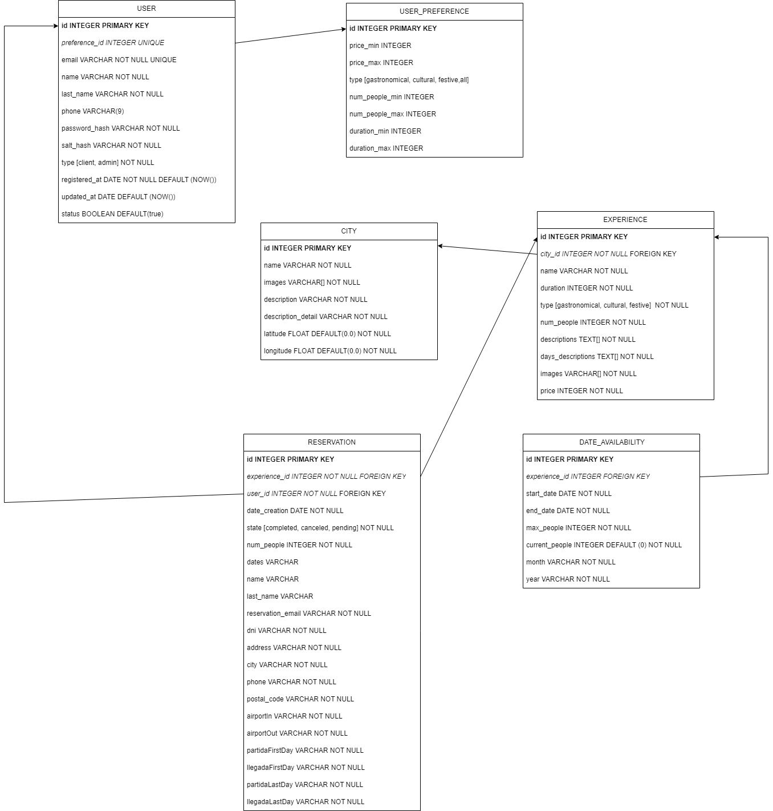

# Rainbow Voyage - Agencia de Viajes LGTBIQA+  🛩🏳️‍🌈

## Descripción del Proyecto 

La agencia de viajes Rainbow Voyage ofrece una experiencia única para aquellos que buscan destinos inclusivos y vibrantes en España. En nuestra página principal, presentamos una cuidadosa selección de destinos ideales para la comunidad LGTBIQA+, cada una con sus propias experiencias festivas, culturales y gastronómicas.

Nuestro enfoque es proporcionar información sobre estas experiencias, asegurando que sean acogedoras y seguras para todos. Además, ofrecemos una variedad de opciones de alojamiento, actividades y servicios que se adaptan a las necesidades de nuestra comunidad diversa.

Para facilitar la búsqueda, nuestra plataforma permite filtrar las experiencias según el rango de precio, el número de participantes, el tipo de experiencia y la duración en días.

Realizar una reserva es simple y fácil. Después de elegir una experiencia y un rango de fechas, los usuarios pueden verificar la disponibilidad y seleccionar el número de personas que desean participar. Luego, proceden a una página de confirmación donde revisan sus datos y el método de pago antes de finalizar la reserva. Tendrán que realizar la confirmación que el titular y acompañantes son mayores de edad.

## Abstract

Rainbow Voyage is an innovative website designed to offer unique and safe travel experiences in selected destinations in the peninsula and archipelagos for the LGTBIQA+ community. This project addresses the need for inclusive destinations by providing detailed information on festive, cultural and gastronomic experiences in cities. The platform allows users to filter experiences according to their preferences, make reservations easily and manage their profiles and bookings. This project highlights the importance of LGTBIQA+ in creating a welcoming and authentic space for LGTBIQA+ travellers in the country.

## Enlace de producción
- Enlace de producción: https://rainbow-voyage-web.vercel.app/
  - USUARIOS DE PRUEBA
    - Usuario cliente:
      - Correo : test@gmail.com
      - Contraseña: test1234
    - Usuario administrador:
      - Correo: admin@gmail.com
      - Contraseña: admin2024
  - Nota PWA
      - Para poder instalar la aplicación en el móvil o en el escritorio hay que acceder al enlace proporcionado desde el navegador Google Chrome.
      - Para efectuar la instalación de la PWA hay que pulsar el siguiente icono ubicado en el extremo derecho en la barra de navegación:

         
   - Nota Reservas
      - Se pueden hacer reservas en junio de 2024 en todas las experiencias.
 

## Miembrxs

- Carolina Blanco 
- Carlos Tarrias
- Nerea Tirado

## Público Objetivo y Justificación 

Nuestra aplicación de agencia de viajes está enfocada a satisfacer las necesidades turísticas del público LGTBIQ+ de España (mayores de edad) que quieran realizar viajes o rutas a ciudades, visitar puntos turísticos LGTBI friendly, lugares emblemáticos y simbólicos para la comunidad, de manera que tengan una experiencia acogedora y segura.

Esta comunidad abarca una amplia gama de identidades de género y orientaciones sexuales, lo que requiere un enfoque inclusivo y respetuoso en todos los aspectos de la aplicación.

La web está dirigida a personas que quieren viajar en grupo con miembros de la comunidad.
Nuestro público objetivo abarca a personas adultas de todas las edades, ya que entendemos que hay necesidades y preferencias diferentes entre los diferentes grupos de edad.

Estará disponible a nivel nacional para aquellos que desean explorar otras ciudades o comunidades.

## Justificación:

  - **Demanda del Mercado**: Existe una creciente demanda de destinos y servicios turísticos que sean inclusivos y acogedores para la comunidad LGTBIQA+. Rainbow Voyage aborda esta demanda al ofrecer una plataforma dedicada a experiencias de viaje diseñadas específicamente para satisfacer las necesidades y preferencias de este público objetivo.

  - **Inclusividad y Seguridad**: La comunidad LGTBIQA+ a menudo enfrenta desafíos y discriminación al viajar, lo que puede afectar negativamente su experiencia. Para abordar esto proporcionamos información detallada sobre destinos seguros y experiencias amigables, garantizando así una experiencia de viaje positiva y sin preocupaciones.

  - **Promoción del Turismo LGTBIQA+**: La plataforma contribuye a la promoción del turismo LGTBIQA+ en España, destacando destinos y servicios que son conscientes y respetuosos de la diversidad sexual. Esto no solo beneficia a los viajeros LGTBIQA+, sino que también impulsa el desarrollo económico y social de las comunidades locales.

  - **Alianzas y Colaboraciones: LGTBIQA+**: A largo plazo está planificado que se puedan establecer alianzas estratégicas con empresas, organizaciones y destinos que comparten su compromiso con la inclusividad y la diversidad. Estas colaboraciones pueden ampliar el alcance de la plataforma y fortalecer su posición como líder en el mercado de viajes LGTBIQA+ en España.

## Herramientas y Lenguajes 

- Front-end: HTML5, CSS3, JavaScript
- Framework de desarrollo web: Vue (Composition API + Typescript)
- Back-end: Node.js, Express.js
- Base de datos: PostgreSQL
- Sistema de control de versiones: Git
- Hospedaje web: Vercel
- ORM: Prisma

## Wireframes y mockups 

[[Figma](https://www.figma.com/file/SNy6ifs3bIzQ96xvRYjtSJ/Dise%C3%B1o-UI-Rainbow-Voyage?type=design&node-id=0-1&mode=design)] 

## Diagrama de Casos de Uso 

  

## Diagrama de Arquitectura 

 

## Diagrama de Despliegue 

 

## Diagrama de Tipos

 

## Modelo E-R 

  

## Modelo Relacional 
   

## Videos de Demo de la Aplicación 

- ### Inicio de sesión y registro en la web
  Mediante el botón ‘Iniciar sesión’ podremos visualizar el formulario de inicio de sesión. En el caso del registro mediante el botón 'Registro' que nos pedirá los datos correspondientes (nombre de usuario, correo electrónico, contraseña,...).
  Ambos formularios tienen un sistema de validación de campos, en caso de que no se introduzcan los datos correctamente, se mostrarán mensajes de error.

  [Enlace a demostración de inicio de sesión y registro](https://www.youtube.com/watch?v=1cQ3fZwfwuI)

<!--  -->

  

- ### Reserva de una experiencia
  Tanto como con la sesión iniciada como si no, dentro del listado de experiencias de una ciudad, podemos entrar al detalle de una experiencia pulsando el botón de "Desde ***€". Una vez en el detalle podremos seleccionar el mes y la fecha que queramos reservar. Una vez establecida la fecha accederemos al formulario de reserva donde habrá que especificar varios datos (dni, coreo, aeropuertos,...). Al cumplimentar el formulario, nos aparecerá la reserva en nuestra lista de reservas en Perfil > Mis Reservas.

    [Enlace a demostración de reserva de una experiencia](https://www.youtube.com/watch?v=046VfNfy0sY)

    
<!--  -->

- ### Editar datos de la cuenta

  Una vez iniciada sesión, en Perfil podemos modificar nuestros datos además de especificar preferencias y filtros como pueden ser: precio, número de personas, tipo de experiencia, duración en días, etc. Para una búsqueda de experiencias más personalizada.

    [Enlace a la demostración de edición de datos de perfil](https://youtu.be/ocNBoCGSgSc)
 
<!--  -->

- ### Búsqueda y filtrado de experiencias

  Los usuarios podrán buscar destinos basados en sus preferencias de perfil (si han iniciado sesión) y por filtros generales (precio, número de personas, tipo de experiencia, etc).

    [Enlace a demostración de filtrado de experiencias](https://www.youtube.com/watch?v=9rnecUjM7wg)

<!--  -->

- ### Información y detalle de la reserva

  Una vez el usuario ha realizado una reserva puede consultar su detalle (y si se ha confirmado o no) 
  en su perfil. Además puede imprimir la información en formato PDF. 

  [Enlace a demostración de detalle de reserva](https://youtu.be/qwO0rO7LHb4)

- ### Foto de portada varía en función de la ubicación

  La foto de la página principal cambia en función de la ubicación del usuario. 
  En la foto se muestra la ciudad más cercana a la posición del usuario.
  En la siguiente demo podemos ver como un usuario simulado se conecta desde Mumbai (India) ve la foto
  de la ubicación más cercana, en este caso, Málaga.

  [Enlace a demostración de foto de portada](https://youtu.be/0btZLmRBkys)

<!--  -->

- ### Panel de control del administrador

  Como administrador de la web, una vez se ha iniciado sesión, desde el panel de control podemos gestionar las diferentes reservas de los usuarios y enviar un correo electrónico al titular de la reserva, confirmando su reserva. 
  Las reservas se pueden filtrar por el titular de la reserva o por su estado (completada o pendiente).

    [Enlace a demostración de panel de administrador - parte 1-](https://youtu.be/n2GzSqtZ63o)

    [Enlace a demostración de panel de administrador - parte 2-](https://youtu.be/hNsVokRYDs4)

<!--  -->

## Problemas Encontrados y Soluciones

A nivel técnico uno de los problemas a los que nos hemos enfrentado a lo largo del proyecto ha sido el hecho de subirlo a producción en el entorno de Vercel, principalmente por desconocimiento de la plataforma.

Aunque, fundamentalmente, los problemas los hemos encontrado en cuanto a la estructura de la oferta de destinos debido a una limitada disponibilidad de destinos y actividades orientadas a la comunidad LGTBIQA+. Lo cual ha requerido una proceso de investigación, y ha dificultado en un inicio la creación de una oferta diversa y atractiva para el usuario.

También hemos encontrado dificultades a la hora de ofertar y planificar actividades turísticas que realmente respondiesen a los gustos de nuestro público, debido a nuestro desconocimiento sobre preferencias y demandas de la comunidad LGTBIQA+.

## Futuras Mejoras 

Una de las funcionalidades que nos hubiera gustado implementar hubiera sido la ampliación de nuestra oferta de destinos más allá de nuestra región actual. Queremos incluir una variedad más amplia de opciones internacionales conocidas por su apertura y aceptación hacia la comunidad LGTBIQA+.

Además, la aplicación se puede mejorar si se establece una comunidad en línea donde los usuarios podrían compartir experiencias, consejos de viaje y conectar con otros viajeros LGTBIQA+.

También hubiera sido interesante desarrollar un programa de membresía que ofrezca beneficios exclusivos a usuarios frecuentes, como descuentos en experiencia, acceso a eventos especiales y regalos promocionales. siempre y cuando se hubieran establecido partnerships estratégicos con organizaciones LGTBIQA+, agencias de viajes y empresas turísticas para ofrecer paquetes exclusivos y descuentos a los usuarios de Rainbow Voyage.

## Comparación de Objetivos y Logros 

Durante el desarrollo de nuestro proyecto, nos propusimos una serie de funcionalidades clave que consideramos fundamentales para garantizar una experiencia óptima para nuestros usuarios.

Gracias a una planificación cuidadosa, y un compromiso constante en todos los sprint del proyecto, tenemos la seguridad de que hemos logrado cumplir con todos nuestros objetivos iniciales; desarrollando todas las funcionalidades planificadas y proporcionando una aplicación sólida. 

## Conclusiones

Este proyecto nos ha permitido realizar una planificación detallada y realista, considerando las necesidades y expectativas específicas de la comunidad LGTBI en el ámbito de los viajes. 

A lo largo del desarrollo, hemos enfrentado desafíos como la falta de conocimientos en nuestro equipo, lo que nos ha llevado a organizar e investigar las funcionalidades que podríamos implementar de manera efectiva.

Cabe mencionar que la diversidad de enfoques y habilidades dentro del equipo nos ha exigido una comunicación clara y una distribución equitativa de las tareas, lo que ha contribuido a conseguir nuestros objetivos en los plazos establecidos.
Este proyecto nos ha permitido asentar conocimientos de JS, CSS, VUE, PostgreSQL y Prisma.

El desarrollo de esta agencia de viajes LGTBIQA+ ha sido un proyecto desafiante pero enormemente gratificante. Hemos superado obstáculos y adversidades, demostrando nuestra capacidad para adaptarnos y responder a las necesidades de la comunidad. 

Con lo cual, la plataforma resultante cumple con las expectativas y necesidades iniciales, y estamos entusiasmados por seguir mejorando y expandiendo nuestra oferta para servir a más destinos y comunidades dentro del colectivo LGTBIQA+.
Estas conclusiones reflejan el compromiso de nuestro equipo con la inclusión y la diversidad para sentar las bases para un futuro más tolerante🏳️‍🌈.